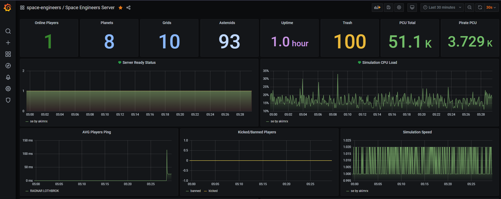

## Grafana SE Server Dashboard

### Usage

* Install prometheus (see config [example](prometheus.yml.example))
* Start prometheus and exporter
* Go to your grafana URL
* Add prometheus datasource to grafana
* Click on "Plus" -> "Import"
* Paste [json data](dashboard.json) to text area with name "Import via panel json"
* Enjoy
